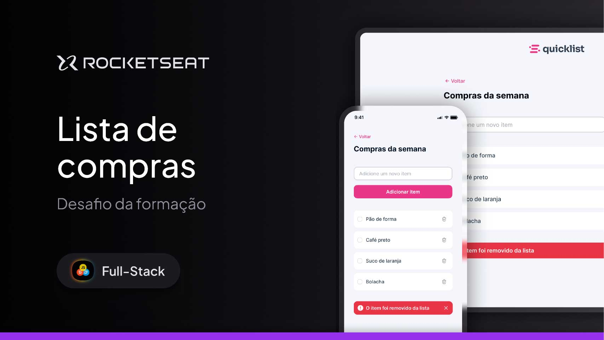

<h1 align="center">🛒 Shopping List</h1>

  Shopping list project developed as part of the <strong>Rocketseat Challenge</strong>, concluding the first module of the JavaScript course.

  <a href="#-about-the-project">About</a>&nbsp;&nbsp;&nbsp;|&nbsp;&nbsp;&nbsp;
  <a href="#-technologies">Technologies</a>&nbsp;&nbsp;&nbsp;|&nbsp;&nbsp;&nbsp;
  <a href="#-layout">Layout</a>&nbsp;&nbsp;&nbsp;|&nbsp;&nbsp;&nbsp;
  <a href="#memo-license">License</a>

  

 

  

---

## 🚀 About the Project

This project is a simple shopping list where users can add items, mark them as completed (strikethrough), and remove items from the list. The list saves data to **localStorage** so items persist after page reload.

The layout was created based on the Rocketseat Figma design, using **HTML** and **CSS** skills. For the programming logic, I reviewed concepts with the Dev Aprender - Jhonatan de Souza channel and applied the 5Qs method to plan the algorithm. I also counted on ChatGPT’s help to structure and validate the JavaScript code.

This project helped me solidify important fundamentals such as DOM manipulation, event handling, form validation, and local storage.

---

## 🛠 Technologies

This project was built with:

- HTML
- CSS
- JavaScript (ES6+)
- DOM Manipulation
- LocalStorage
- Git & GitHub
- Figma (for the design)
- Responsiveness techniques

---

## 🔗 Live Project

➡️ [Access the live version](https://andreskull2.github.io/shopping-list/)  
🎓 [Rocketseat JavaScript Course](https://www.rocketseat.com.br/formacao/javascript)

---

## 🎨 Layout

Check out the original Figma layout:

🔗 [View on Figma](https://www.figma.com/community/file/1397279978314668489) *(Figma account required)*

---

## :memo: License

This project is licensed under the **MIT License**.  
Feel free to use it as a reference or study material — just remember to give proper credit.

---

Made with ♥ by Rocketseat — Rebuilt with care by @your-username 🚀  
:wave: [Join the Rocketseat community!](https://discord.gg/rocketseat)

